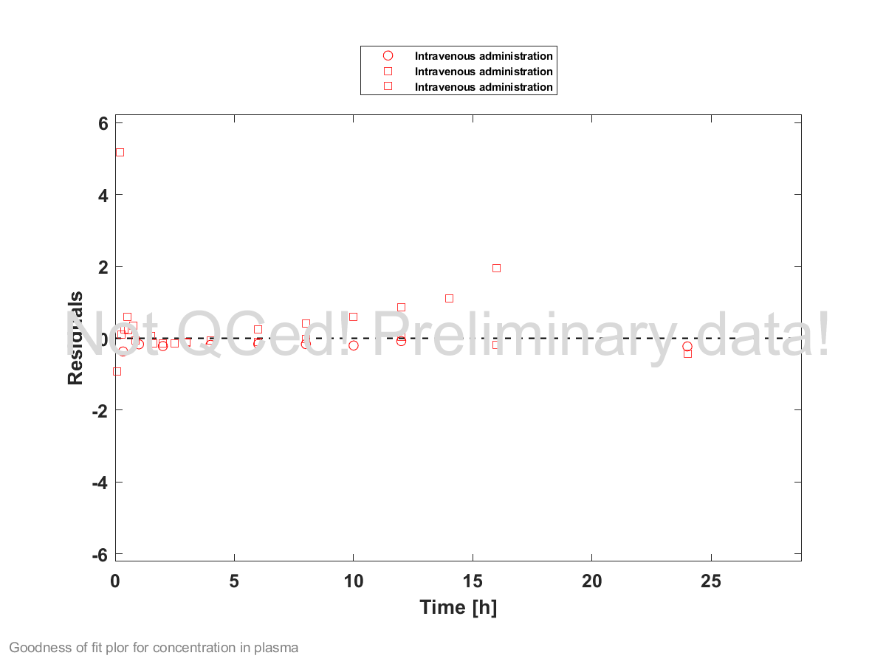
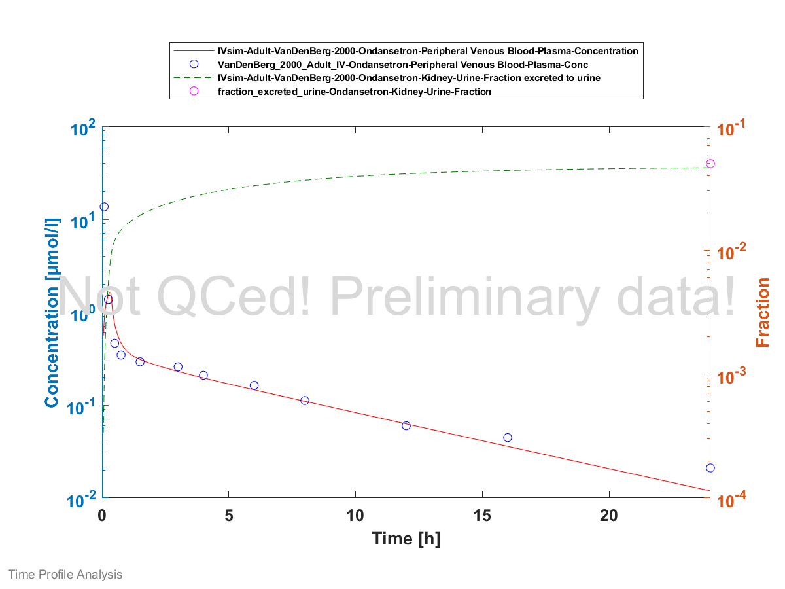

# Building and Evaluation of a PBPK Model for Ondansetron in Adults

| Version     | 0.1       |
| ----------- | --------- |
| OSP Version | 8.0       |
| Author      | flyhighyj |

# Table of Contents
  * [1 Introduction](#1-introduction)
  * [2 Methods](#2-methods)
    * [2.1 Modeling Strategy](#21-modeling-strategy)
    * [2.2 Data](#22-data)
    * [2.3 Model Parameters and Assumptions](#23-model-parameters-and-assumptions)
  * [3 Results and Discussion](#3-results-and-discussion)
    * [3.1 Final input parameters](#31-final-input-parameters)
    * [3.2 Diagnostics Plots](#32-diagnostics-plots)
    * [3.3: Concentration-Time Profiles](#33-concentration-time-profiles)
      * [3.3.1 Model Building](#331-model-building)
      * [3.3.2 Model Verification](#332-model-verification)
  * [4 Conclusion](#4-conclusion)
  * [5 References](#5-references)
# 1 Introduction
Ondansetron is metabolized by used to prevent nausea and vomiting caused by cancer chemotherapy or surgery. It is metabolized by both CYP3A4 and CYP1A2. The fraction excreted unchanged in urine is 5%. 

# 2 Methods

## 2.1 Modeling Strategy
The general concept of building a PBPK model has previously been described by Kuepfer et al. ([Kuepfer 2016](#5-References)) Regarding the relevant anthropometric (height, weight) and physiological parameters (e.g. blood flows, organ volumes, binding protein concentrations, hematocrit, cardiac output) in adults was gathered from the literature and has been previously published ([PK-Sim Ontogeny Database Version 7.3](#References)). The information was incorporated into PK-Sim® and was used as default values for the simulations in adults.

The  applied activity and variability of plasma proteins and active processes that are integrated into PK-Sim® are described in the publicly available PK-Sim® Ontogeny Database Version 7.3 ([Schlender 2016](#5-References)) or otherwise referenced for the specific process.

First, a base mean model was built using literature data including selected intravenous single dose studies with Ondansetron to find an appropriate structure to describe the pharmacokinetics in plasma. The mean PBPK model was developed using a typical European individual.

For clearance, first order process was assumed. Specific clearance and lipophilicity were optimized based on the observed plasma concentration vs. time coefficients using the Parameter Identification module provided in PK-Sim®. 

The model was then verified by simulating:

- plasma concentration vs. time profile 

Details about input data (physicochemical, *in vitro* and clinical) can be found in  [Section 2.2](#2.2	Data).

Details about the structural model and its parameters can be found in  [Section 2.3](#2.3 Model Parameters and Assumptions).

Details about model development was
described in Yun and Edginton (2019). 

## 2.2 Data
### 2.2.1	In vitro / physico-chemical Data

A literature search was performed to collect available information on physiochemical properties of dapagliflozin. The obtained information from literature is summarized in the table below. 

| **Parameter**   | **Unit**    | **Value** | Source                                 | **Description**                                 |
| :-------------- | ----------- | --------- | -------------------------------------- | ----------------------------------------------- |
| MW              | g/mol       | 293.37    | Drugbank [DB00904]                     | Molecular weight                                |
| pKa  |             | 7.34      | Drugbank [DB00904]                     | Acid dissociation constant                      |
| Solubility (pH) | mg/L (pH 7) | 0.3551    | Drugbank [DB00904]                     | Aqueous Solubility, FaSSIF, ...                 |
| logP            |             | 1.59      | Optimized                              | Partition coefficient between octanol and water |
| fu              | %           | 27        | Elkomy et al. 2015                     | Fraction unbound in plasma                      |
| B/P ratio       |             | 0.83      | [Simpson & Hicks, 1996](#5 References) | Blood to plasma ratio                           |
| ...             |             |           |                                        | ....                                            |

### 2.2.2	Clinical Data

A literature search was performed to collect available clinical data on dapagliflozin in healthy adults.

#### 2.2.2.1	Model Building

The following studies were used for model building (training data):

| Publication                 | Arm / Treatment / Information used for model building        |
| :-------------------------- | :----------------------------------------------------------- |
| Colthup 1991                | Healthy Subjects with a single intravenous dose of 8 mg infused for 15 minutes |
| [Blake 1993](#7 References) | Healthy Subjects with a single intravenous dose of 8 mg infused for 5 minutes |
| VanDenBerg 2000             | Healthy Subjects with a single intravenous dose of 24 mg infused for 20 minutes |

#### 2.2.2.2	Model Verification

The following studies were used for model verification:

| Publication | Arm / Treatment / Information used for model building |
| :---------- | :---------------------------------------------------- |
| ...         | ...                                                   |
| ...         | ...                                                   |

## 2.3 Model Parameters and Assumptions
### 2.3.1	Absorption

Not applicable as an intravenous route was used.

### 2.3.2	Distribution

...

After testing the available organ-plasma partition coefficient and cell permeability calculation methods built in PK-Sim, observed clinical data was best described by choosing the partition coefficient calculation by `Rodgers and Rowland` and cellular permeability calculation by `PK-Sim Standard`. 

...

### 2.3.3	Metabolism and Elimination

Ondansetron undergoes primarily hepatic metabolism specifically CYP 3A4 and CYP 1A2. The fraction excreted unchanged in urine is 5%. 

### 2.3.4	Automated Parameter Identification

# 3 Results and Discussion
The PBPK model for Ondansetron was developed with clinical pharmacokinetic data.

The next sections show:

1. the final model parameters for the building blocks: [Section 3.1](#3.1 Final Input Parameters).
2. the overall goodness of fit: [Section 3.2](#3.2 3.2 Diagnostics Plots).
3. simulated vs. observed concentration-time profiles for the clinical studies used for model building: [Section 3.3](#3.3 Concentration-Time Profiles).

## 3.1 Final input parameters
The compound parameter values of the final PBPK model are illustrated below.

# Compound: Ondansetron

## Parameters

Name                                       | Value          | Value Origin | Alternative | Default |
------------------------------------------ | -------------- | ------------:| ----------- | ------- |
Solubility at reference pH                 | 0.3551 mg/l    |              | Measurement | True    |
Reference pH                               | 7              |              | Measurement | True    |
Lipophilicity                              | 1.59 Log Units |              | Measurement | True    |
Fraction unbound (plasma, reference value) | 0.27           |              | Measurement | True    |
Is small molecule                          | Yes            |              |             |         |
Molecular weight                           | 293.37 g/mol   |              |             |         |
Plasma protein binding partner             | Albumin        |              |             |         |
## Calculation methods

Name                    | Value           |
----------------------- | --------------- |
Partition coefficients  | PK-Sim Standard |
Cellular permeabilities | PK-Sim Standard |
## Processes

### Metabolizing Enzyme: CYP1A2-CYP1A2

Species: Human
Molecule: CYP1A2
#### Parameters

Name                | Value      | Value Origin |
------------------- | ---------- | ------------ |
Intrinsic clearance | 0 l/min    |              |
Specific clearance  | 0.13 1/min | Unknown      |
### Metabolizing Enzyme: CYP3A4-CYP3A4

Species: Human
Molecule: CYP3A4
#### Parameters

Name                | Value       | Value Origin |
------------------- | ----------- | ------------ |
Intrinsic clearance | 0 l/min     |              |
Specific clearance  | 0.195 1/min | Unknown      |
### Systemic Process: Glomerular Filtration-GFR

Species: Human
#### Parameters

Name         | Value | Value Origin |
------------ | -----:| ------------: |
GFR fraction |  0.71 |              |

## 3.2 Diagnostics Plots
Below you find the goodness-of-fit visual diagnostic plots for the PBPK model performance of all data used presented in [Section 2.2.2](#2.2 2	Clinical Data).

The first plot shows observed versus simulated plasma concentration, the second weighted residuals versus time. 

GMFE = 1.442728 

## 3.3: Concentration-Time Profiles
Simulated versus observed concentration-time profiles of all data listed in [Section 2.2.2](#2.2.2	Clinical Data) are presented below.

### 3.3.1 Model Building

### 3.3.2 Model Verification

# 4 Conclusion
The herein presented PBPK model adequately describes the pharmacokinetics of Ondansetron in adults. Details of model development can be found in Yun and Edginton (2019).

# 5 References
**Kuepfer 2016** Kuepfer L, Niederalt C, Wendl T, Schlender JF, Willmann S, Lippert J, Block M, Eissing T, Teutonico D. Applied Concepts in PBPK Modeling: How to Build a PBPK/PD Model.CPT Pharmacometrics Syst Pharmacol. 2016 Oct;5(10):516-531. doi: 10.1002/psp4.12134. Epub 2016 Oct 19. 

**Blake 1993** Blake, J. C., J. L. Palmer, N. A. Minton, and A. K. Burroughs. The pharmacokinetics of intravenous ondansetron in patients with hepatic impairment. Br J Clin Pharmacol. 35:441–43. doi:10.1111/j.1365-2125.

**Colthup 1991** Colthup, P.V., Felgate, C.C., Palmer, J.L. & Scully, N.L. Determination of ondansetron in plasma and its pharmacokinetics in the young and elderly. Journal of pharmaceutical sciences 80, 868-71. 

**Drugbank DB00904** Drugbank DB00904 https://www.drugbank.ca/drugs/DB00904

**Elkomy 2015** Elkomy, M. H., Sultan, P., Carvalho, B., Peltz, G., Wu, M., Clavijo, C., Drover, D. R. . Ondansetron pharmacokinetics in pregnant women and neonates: towards a new treatment for neonatal abstinence syndrome. Clin Pharmacol Ther, 97(2), 167-176.

PK-Sim Ontogeny Database Version 7.3 (https://github.com/Open-Systems-Pharmacology/OSPSuite.Documentation/blob/38cf71b384cfc25cfa0ce4d2f3addfd32757e13b/PK-Sim%20Ontogeny%20Database%20Version%207.3.pdf) 

**Schlender 2016** Schlender JF, Meyer M, Thelen K, Krauss M, Willmann S, Eissing T, Jaehde U. Development of a Whole-Body Physiologically Based Pharmacokinetic Approach to Assess the Pharmacokinetics of Drugs in Elderly Individuals. Clin Pharmacokinet. 2016 Dec;55(12):1573-1589. 

**Simpson 1996** Simpson, K. H., & Hicks, F. M. Clinical pharmacokinetics of ondansetron. A review. Journal of pharmacy and pharmacology, 48(8), 774-781. 

**Vandenberg 2000** Vandenberg, C. M., Y. Kazmi, J. Stewart, D. J. Weidler, S. N. Tenjarla, E. S. Ward, and M. W. Jann. Pharmacokinetics of three formulations of ondansetron hydrochloride in healthy volunteers: 24-mg oral tablet, rectal suppository, and i.v. infusion. Am J Health Syst Pharm. 57:1046–50.

**Yun 2019** Yun, Y.E. and A.N. Edginton, Model qualification of the PK-Sim® pediatric module for pediatric exposure assessment of CYP450 metabolized compounds. Journal of Toxicology and Environmental Health, Part A, 2019: p. 1-26.

